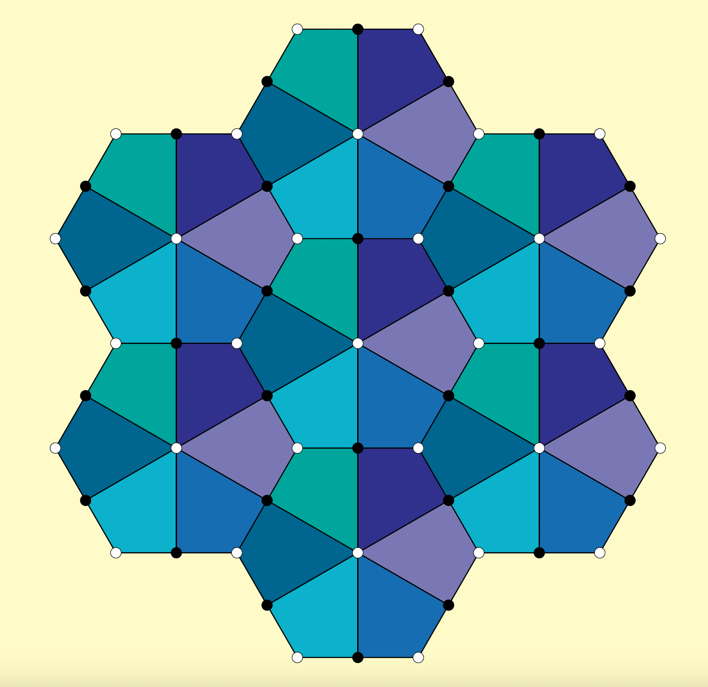

# Machine learning toric duality in brane tilings
This project aims to classify/identify Dimers which are equivalent under Seiberg duality.

We focus mostly on two cases:
- $\mathbb{Z}_m\times\mathbb{Z}_n$ orbifolds of the conifold
- the $Y^{6,0}$ dimer.

For the $\mathbb{Z}_m\times\mathbb{Z}_n$ orbifolds of the conifold, we train a fully connected network to predict the labels $(m,n)$.
Whereas we trained a residual neural network to classify/predict the toric phases of the $Y^{6,0}$ dimer.

More information can be found in our original paper [arxiv:2409.15251](https://arxiv.org/abs/2409.15251).



## Python requirements
This project was created using specific python and tensorflow versions.
> [!IMPORTANT]
> - python version == 3.11.x (3.10.x on linux)
> - tensorflow version == 2.16.1

The authors have not tested any other versions, and cannot guarantee a bug-free experience elsewise.
All required packages can be found in the `requirements.txt` file.

## Running our code
This repo contains code for training, evaluation and even dataset generation.

### Evaluation
Both evaluation files for the fully connected and ResNet can be found in their respective sub-directories
```
DimerML
└───models
│   └───dense
│   |    └───evaluate.py
│   |    └───train.py
│   |    └───...
│   └───ResNet
│        └───evaluate.py
│        └───train.py
│        └───...
└───...
```
These contain a set of example Kasteleyn matrices and link to our model checkpoints. You can directly run them with the given parameters to get the model's outputs.

### Training
If you wish to train your own network, with a different set of parameters, you must first unzip our datasets found in `DimerML/datasets`. You are then free to run the `train.py` files with your chosen parameters.

### Dataset generation
Those who wish to generate a completely new dataset with either larger matrix sizes or more iterations can use the `dataset_generator.py` file. Note that this file requires one to unzip the `ZmZn_matrices.zip`.
